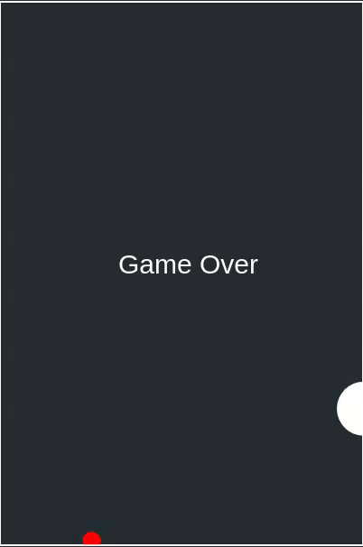

# Spiral Dodger Game

A simple browser-based game where a player controls a dot and tries to dodge incoming spirals. The game features gravity, spirals that move from the right edge of the canvas, and collision detection that triggers a "Game Over" message. Players can make the dot "flap" upward to avoid obstacles.

## Features

- **Gravity Simulation**: The dot is affected by gravity, making it fall unless the player makes it flap.
- **Spirals**: Spirals appear randomly on the right side of the canvas and move toward the dot. If the dot collides with a spiral, the game ends.
- **Flap Mechanic**: Press any key to make the dot "flap" upward.
- **Game Over Detection**: If the dot collides with a spiral or moves off the canvas, the game displays a "Game Over" message.

## Game Controls

- **Flap**: Press any key to make the dot jump upwards.

## Code Structure

- **`dot` Object**: Defines the player's controlled dot with properties for position, radius, and vertical velocity.
- **`spirals` Array**: Holds all spiral obstacles with each spiral's x, y, and angle position.
- **`createSpiral` Function**: Generates a new spiral off the right edge of the canvas with a random angle and y-position.
- **`update` Function**: The main game logic, which:
  - Moves the dot based on gravity.
  - Creates spirals periodically.
  - Updates spiral positions, moving them left.
  - Checks for collisions between the dot and spirals.
  - Ends the game if a collision is detected or if the dot moves out of bounds.
- **`draw` Function**: Clears the canvas and redraws all game elements (dot, spirals). Displays "Game Over" if the game ends.
- **`flap` Function**: Increases the dot's upward velocity, creating a "flap" effect. If the game is over, it resets the game.
- **`resetGame` Function**: Resets the dot’s position, velocity, and clears all spirals for a new game.
- **Event Listener**: Listens for any key press to trigger the `flap` action.

## How to Run

1. Open `index.html` in a web browser that supports HTML5 and JavaScript.
2. The game will start immediately with spirals moving from the right edge.
3. Press any key to make the dot flap and avoid the spirals.

